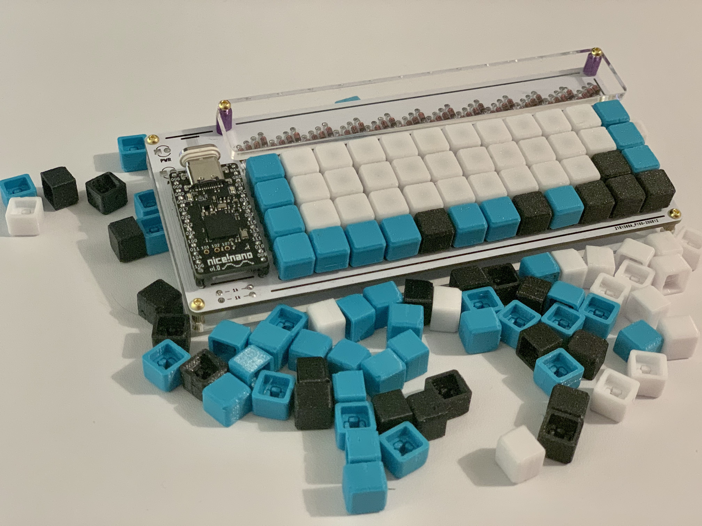
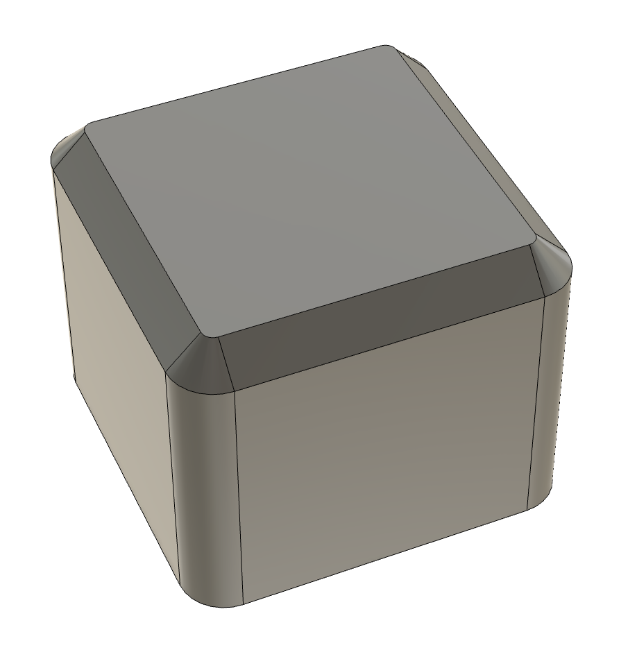
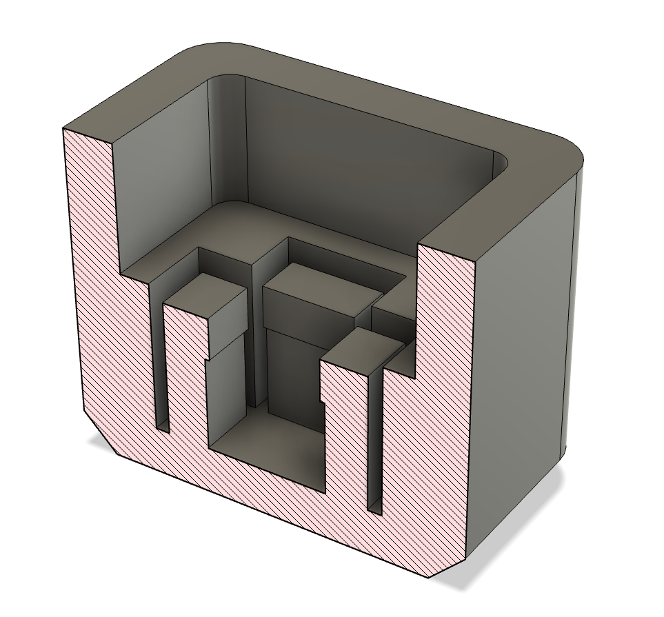

# PocketType Keycaps

I designed some new keycaps for the
[PocketType](https://mechboards.co.uk/shop/kits/pockettype/) tiny portable
keyboard.

## Modification

The [Fusion360](https://www.autodesk.com/products/fusion-360) (free for
hobbiests) source file is included if you want to tweak them.

## Printing

There's an STL included, which is the same model as the Fusion source, so
you can either load the STL directly into your slicer, or convert it yourself
from Fusion. The model is provided upside-down to give the tops the best
possible finish, however there's only a single key in the model so you may want
to add multiple instances if you want a whole set. Print a couple extra!

They work fine with PrusaSlicer's default settings. The only change I'd
recommend is setting the seam to "Back" as improves the quality of
the corners and it's pretty easy to hide the seam.

They're tuned for printing at 0.1-0.2mm, mainly because of the
internal clips being a little bit resolution-sensitive:

Personally I like to print them on a textured plate with PETG to give them a
nice texture.

## Post Processing

The internal "shoulder" is designed to bottom out on the top of the switch,
which greatly improves the feel - but can be a little hit and miss. If any keys
don't sit right on the switches then I'd recommend cleaning out any
stringy bits or other 3D printing crud that's in there - the tolerances are
fairly tight.

